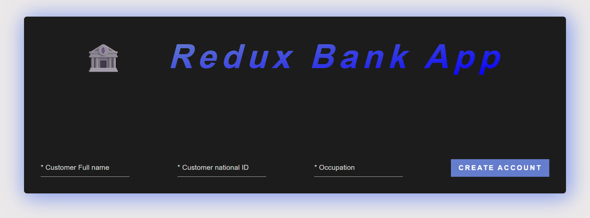
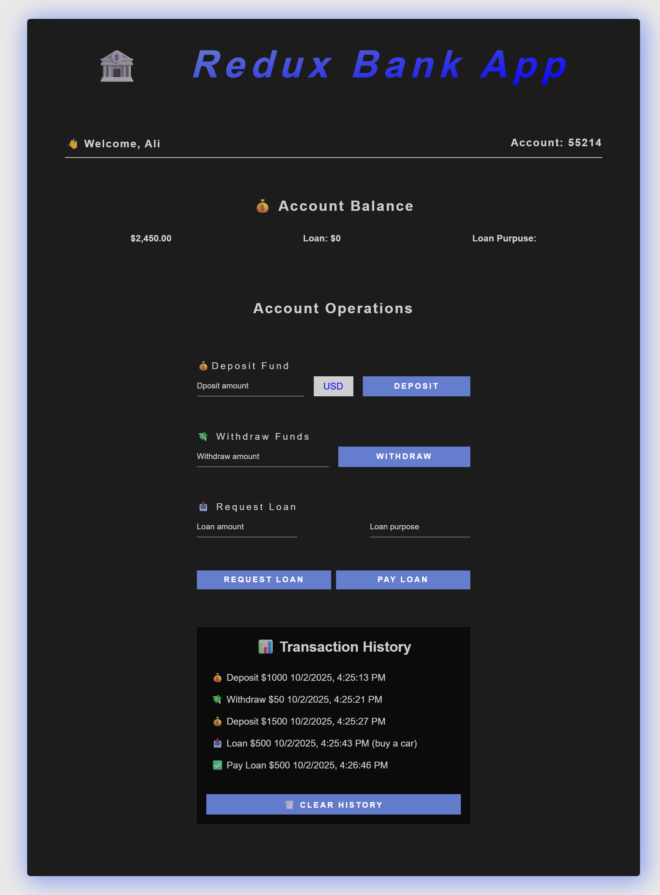

# 🏦 Redux Bank App

A simple **Banking Application** built with **React** and **Redux Toolkit**.  
This project was created for learning and practicing **state management with Redux**, including `createSlice`, `createAsyncThunk`, and `extraReducers`.

---

## ✨ Features

- Create a customer account with Full Name & National ID
- Deposit money (supports currency conversion to USD)
- Withdraw money (with balance validation)
- Request and pay loans (with simple conditions)
- View and clear transaction history
- Fully managed with Redux state

---

## 🛠️ Technologies Used

- React
- Redux Toolkit
- React Redux
- Vite
- Modern JavaScript (ES6+)
- CSS3

---

## 📸 Screenshot

## 🌐 Live view ["https://aymaq-code.github.io/redux-bank/"]
